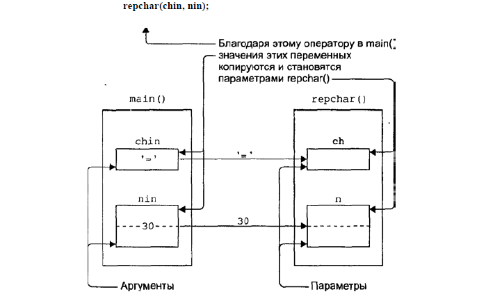
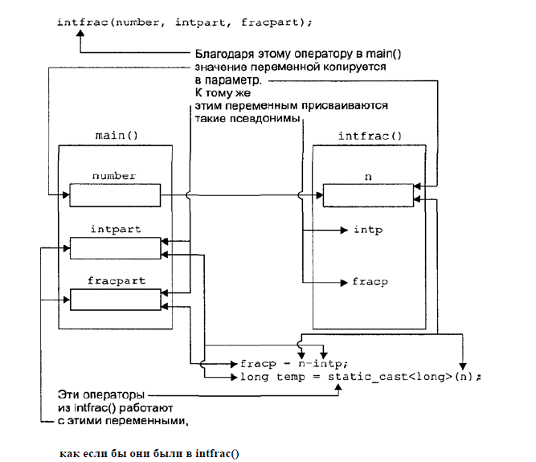
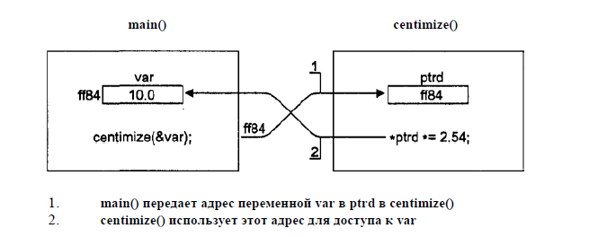
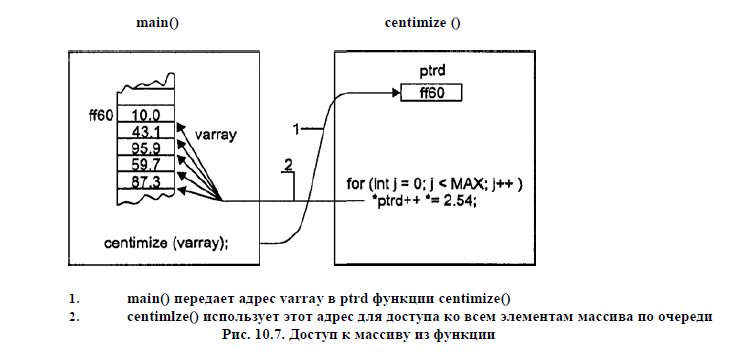

# Передача параметров в функцию
> В С++ в функцию можно передать параметры тремя способами: по значению, по ссылке и по указателю. Сейчас мы рассмотрим каждый из вариантов

Передача по значению
===
>Фактически, при передаче параметров по значению, мы создаем копии каждого из переданных параметров внутри функции
```cpp
#include <iostream>

void repchar(char ch, int n) {
  for (int j = 0; j < n; j++) {
    std::cout << ch;
    std::cout << "\n";
  }
}

int main() {
  char chin;
  int nin;

  std::cout << "Введите символ: ";
  std::сin >> chin;
  std::cout << "Введите число повторений символа: ";
  std::cin >> nin;

  repchar(chin, nin);
}
```
Как вы заметили, функция repchar имеет тип void, что указывает на то, что функция не возвращает никаких значений. В данном случае функция просто напечатает полученный символ n раз. Так как мы передаем параметры по значению `void repchar(char ch, int n){`, то внутри функции будут созданы копии введенных параметров - ch = chin и n = nin. Такой подход просто и понятен, но не очень рационален с точки зрения использования памяти.

На картинке ниже проиллюстрирована схема передачи параметров в функцию по значению


Передача по ссылке 
===

Как мы видели, функция не имеет доступа к переменным-аргументам, а работает со сделанными ей копиями значений. Разумеется, такой механизм полезен в тех случаях, когда у функции нет необходимости изменять значения аргументов, и мы защищаем аргументы от несанкционированного доступа.

>Вместо того чтобы передавать функции значение переменной, ей передается ссылка на эту переменную (фактически в функцию передается адрес переменной-аргумента в памяти). Важной особенностью передачи аргументов по ссылке является то, что функция имеет прямой доступ к значениям аргументов. 

```cpp
#include <iostream>

void intfrac(float n, float& intp, float& fracp) {
  long temp = static_cast<long>(n);  // преобразование к типу long,
  intp = static_cast<float>(temp);  // и обратно во float
  fracp = n - intp;                 // вычитаем целую часть
}

int main() {
  float number, intpart, fracpart;
  do {
    std::cout << "\nВведите вещественное число";
    std::cin >> number;
    intfrac(number, intpart, fracpart);
    std::cout << "целая часть равна " << intpart << " и дробная часть равна "
              << fracpart << "\n";
  } while (number != 0.0);
}
```
В данном примере мы передали в функцию intfrac ссылки на переменные intpart и fracpart, тем самым позволив функции изменять значения, находящиеся по их адресам, а не создавать копии. Именно это позволяет функции записать ответ в созданные в main переменные и не думать о том, как передать сразу два объекта с помощью return.

На картинке проиллюстрированы отношения переменных и функции


Передача переменных по указателю   
===

> Передача указателя в функцию в качестве аргумента в некоторых случаях похожа на передачу по ссылке. Они обе позволяют переменной вызывающей программы быть измененной в функции. Однако их механизмы различны. Ссылка — это псевдоним переменной, а указатель — это адрес переменной.

Давайте рассмотрим пример передачи в функцию переменной по указателю
```cpp
#include <iostream>

void centimize(double* ptrd) {
  *ptrd *= 2.54;  // *ptrd — это то же самое, что и var
  // потому что при операции разыменовывания ptrd мы получим доступ к данным
  // переменной var
}

int main() {
  double var = 10.0;  // значение переменной var равно 10 (дюймов)
  std::cout << "var = " << var << "дюймов"
            << "\n";
  centimize(&var);  // передаем в функцию адрес перменной var
  std::cout << "var= " << var << "сантиметров" << endl;
}
```
Так как мы передаем в функцию адрес переменной var, то функция cementize создает указатель ptrd на тип double и присваивает ему переданный в функцию адрес переменной var. После чего мы разыменовываем указатель и, получив доступ к var, умножаем ее значение на 2.54



Передача массивов по указателю   
===
```cpp
#include <iostream>

const int MAX = 5;  // количество элементов в массиве

void centimize(double* ptrd)  // передаем указатель на массив
{
  for (int j = 0; j < MAX; j++) {
    *ptrd++ *= 2.54;  // двигаем указатель на единицу, после разыменовываем и
                      // умножаем данные на 2.54
  }
}

int main() {
  double varray[MAX] = {10.0, 43.1, 95.9, 58.7, 87.3};

  centimize(
      varray);  // вызываем функцию, передав адрес первого элемента массива

  for (int j = 0; j < MAX; j++) {
    std::cout << "varray [ " << j << " ] = " << varray[j] << " сантиметров"
              << endl;  // выведем результат
  }
}
```
```bash
varray [ 0 ] = 25.4 сантиметров
varray [ 1 ] = 109.474 сантиметров
varray [ 2 ] = 243.586 сантиметров
varray [ 3 ] = 149.098 сантиметров
varray [ 4 ] = 221.742 сантиметров
```


Теперь рассмотрим вопрос синтаксиса: как узнать, что в выражении *ptrd++ увеличивается указатель, а не его содержимое? Другими словами, как компилятор интерпретирует это выражение: как *(ptrd++), что нам и нужно, или как (*ptrd)++? Здесь * (при использовании в качестве операции разыменования) и ++ имеют одинаковый приоритет. Однако операции одинакового приоритета различаются еще и другим способом: ассоциативностью. 

Ассоциативность определяет, как компилятор начнет выполнять операции, справа или слева. В группе операций, имеющих правую ассоциативность, компилятор выполняет сначала операцию, стоящую справа. Унарные операции * и ++ имеют правую ассоциативность, поэтому наше выражение интерпретируется как *(ptrd++) и увеличивает указатель, а не то, на что он указывает. Таким образом, сначала увеличивается указатель, а затем к результату применяется операция разыменования.


